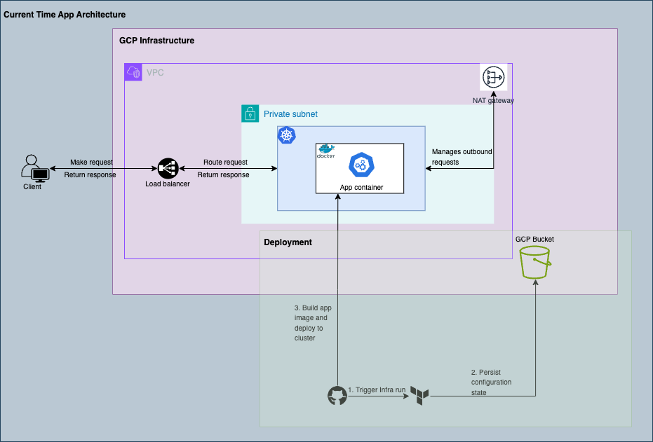

# dt-shortlet

### Prerequisites
- Google Cloud CLI
- Docker
- Terraform


## Docker
Navigate to `api` directory and run below commands:
- Build:
    ```bash
    docker build -t gcr.io/<google_cloud_project_id>/shortlet-app:latest .
    ```

- Run:
    ```bash
    docker run -p 8000:8000 --name shortlet-api shortlet-api:latest
    ```

- Push:
    - Docker use Gcloud for credentials
    ```bash
    gcloud auth configure-docker
    ```

    - Push to GCP artifacts registry
    ```bash
    docker push gcr.io/<google_cloud_project_id>/shortlet-app:latest
    ```

Infrastructure Architecture:


## Terraform
Setting up project with Terraform

1. If to recreate infrastructure on Google Cloud:
- Create google cloud account and a project.
- Create a new bucket in the created project name
- Enable Cloud Resource Manager API cloudresourcemanager.googleapis.com on console before running terraform apply for the first time
- Navigate to `infra` directory and modify the bucket name in the `backend.tf` file to the newly created bucket.
- Create a copy of .tfvars from template and fill the file
    ```bash
    cp terraform.tfvars.template terraform.tfvars
    ```
- Create a service account from the Google Cloud console.
- Create a key in JSON format for the service account created above from the Google Cloud console.
- Add the JSON file (service account key) to the base directory of this project.
- Install Terraform
- Navigate to `infra` directory
- Run `terraform init` # initialize the project
- Run `terraform fmt` # format your terraform code
- Run `terraform plan` # a dry run to see the expected output of your code
- Run `terraform apply --auto-approve` # apply the instructions to create the resources
- To destroy all resources created via Terraform, run `terraform destroy`.

2. If to use currently provisioned infrastructure with created backend Persistence
- A bucket is created on Google cloud with the name `shoplet-tf-state` for persisting Terraform state
- Terraform state is saved in `shoplet-tf-state` Google Cloud storage bucket in this path `terraform/state`.
- Also for persistence, the Terraform `tfvars` file is also saved in the same bucket. Download this file locally to `infra` directory before running `terraform init`.
- Install Terraform
- Navigate to `infra` directory
- Run `terraform init` # initialize the project
- Run `terraform fmt` # format your terraform code
- Run `terraform plan` # a dry run to see the expected output of your code
- Run `terraform apply -auto-approve` # apply the instructions to create the resources
- To destroy all resources created via Terraform, run `terraform destroy`.


## Github Actions
- Add all variables created in `terraform.tfvars` to Github secrets.
- Trigger Workflow with a push to the main branch.
